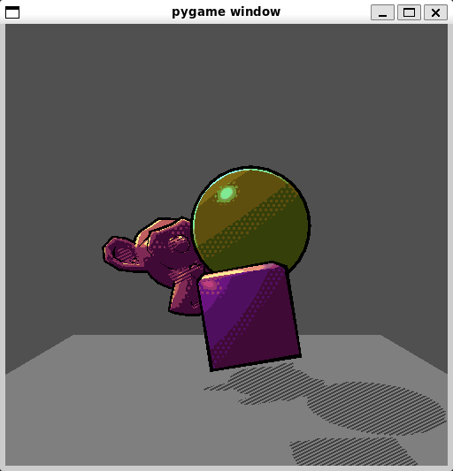
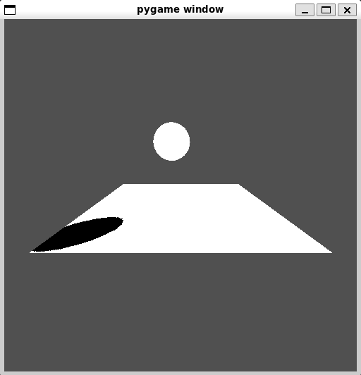
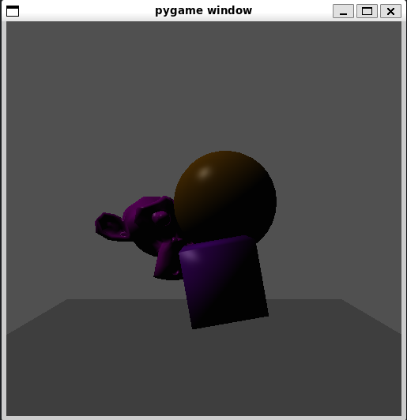
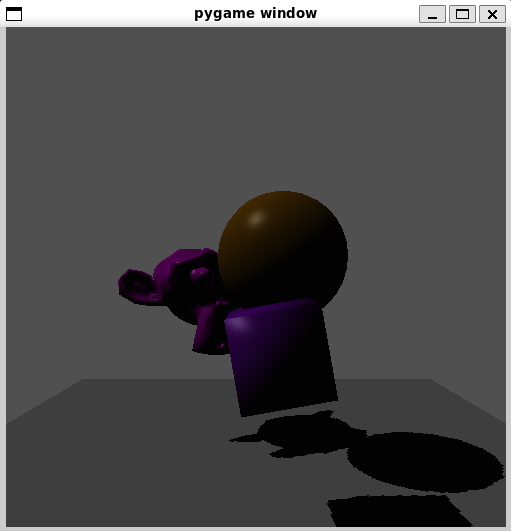
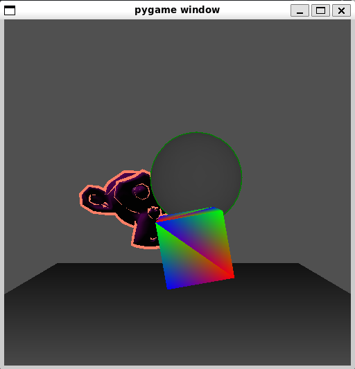

# Computer Graphics Final Project: Non-Photorealistic Rendering and Shadow Mapping
This is the repository for our final project in CS4204: Computer Graphics. Over the semester we had been working on building our own custom render pipeline mostly from the ground up using Python. We used Pygame to serve as our window we could output our frame buffer to, but otherwise all rendering is done with the code we wrote over the course of this class. 

The focus of this class was not to create an optimized render pipeline, so while there are a few techniques used to speed up rendering, our pipeline is much slower than modern render pipelines. Modern render pipelines use the parallel processing of the GPU, efficient data structures, and more efficient programming languages than Python to be capable of rendering dozens, if not hundreds of frames in a second.

Before we began our final project, our render pipeline already supported a number of shading styles, including Blinn-Phong, Gouraud, flat, texture, barycentric, and depth. We were allowed to request to implement into our pipeline any features that interested us. We chose to pursue adding non-photorealistic rendering and shadow maps, but we also had time to add additional features such as outlines and LED board support.

Check out our [slideshow](/Computer%20Graphics%20Project%20Presentation.pdf) for this project to see more details about what we added to the render pipeline we built during this course.

## Render Output
The following images are output inside the pygame window when each file from [run_scripts/](/final_project/run_scripts/) is executed.

### Output of run_stylized.py.
The final results of working on this project. It combines non-photorealistic rendering techniques such as cel shading, stippling, rim lighting, and outlines with shadow maps. Cel shading involves using color "steps" instead of a gradient to represent varying light levels on the mesh. Stippling is a technique used in comic art to represent different shades using dots, which we combine with cel shading. We also have hatching in the cast shadows, which is similar to stippling, but uses lines. Rim lighting is used to create a halo effect around the lit edge an object, which is clearly seen on the sphere. 

### Output of run_shadow_map.py.
A visual representation of the shadow map. Although some shadows are achieved by checking if the normal of the surface faces the direction to the light source, only by adding shadow maps can surfaces blocking light to other surfaces cast shadows. The black in the image represents areas occluded by the sphere according to the shadow map.

### Output of run_blinn_phong_no_shadow.py.
A representation of the Blinn-Phong shading model.

### Output of run_blinn_phong_shadow.py.
The Blinn-Phong shading model with applied shadow maps.

### Output of run_blinn_phong_outline.py.
Outlines added to the Blinn-Phong shaded meshes. The outlines are rendered using the inverted hull technique, which is a method of achieving outlines often used by older games because its efficiency. The inverted hull technique involves duplicating the mesh, flipping the directions of the faces, and scaling the vertices outwards by their vertex normals.

### Output of run_multiple_pass.py.
This image shows different shading techniques being applied to different meshes in the scene. Before this project, our render pipeline was limited to a single shading style in the entire scene, but we chose to add our own "pass" system to make outlines easier to implement.

